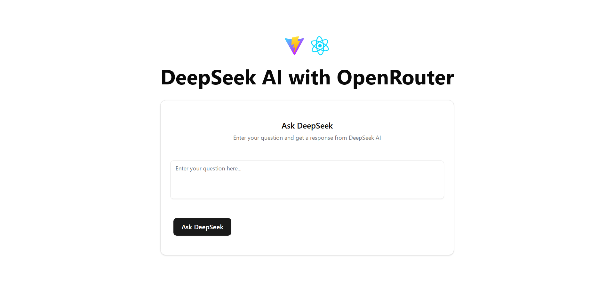

# DeepSeek AI with OpenRouter

DeepSeek AI with OpenRouter is a modern, streamlined web application that enables you to interact with the DeepSeek AI model through the OpenRouter API. Built with React and Vite, this project offers real-time AI responses in a sleek, responsive UI that leverages Markdown for rich content display.



## Features

- **Real-Time Streaming:** Get AI-generated responses on the fly.
- **Intuitive UI:** Clean, responsive interface built with custom UI components.
- **Markdown Support:** Render formatted output for a better reading experience.
- **Request Cancellation:** Abort ongoing requests gracefully using the AbortController.
- **Modern Tooling:** Developed using React, Vite, and the latest web standards.

## Getting Started

Follow these steps to set up the project locally.

### Prerequisites

- [Node.js](https://nodejs.org/en/) (v14+ recommended)
- [npm](https://www.npmjs.com/) or [Yarn](https://yarnpkg.com/)
- An API key from [OpenRouter](https://openrouter.ai)

### Installation

1. **Clone the repository:**

   ```bash
   git clone https://github.com/yourusername/deepseek-ai-openrouter.git
   cd deepseek-ai-openrouter
   ```

2. **Install dependencies:**

   Using npm:

   ```bash
   npm install
   ```

   Or using Yarn:

   ```bash
   yarn install
   ```

3. **Configure Environment Variables:**

   Create a `.env` file in the root directory and add your OpenRouter API key:

   ```env
   VITE_OPENROUTER_API_KEY=your_api_key_here
   ```

### Running the Application

Start the development server:

```bash
npm run dev
```

Or with Yarn:

```bash
yarn dev
```

Then, open your browser and navigate to the URL provided (usually `http://localhost:5173`) to interact with DeepSeek AI.

## Code Overview

The project leverages React’s functional components and Vite’s blazing fast development environment. Key functionalities include:

- **Streaming Responses:**
  - The application sends a POST request to the OpenRouter API endpoint (`https://openrouter.ai/api/v1/chat/completions`) using a streaming approach.
  - Responses are read incrementally, processed, and rendered using a custom Markdown renderer.
- **AbortController for Cancellation:**
  - Requests can be cancelled mid-stream, providing better control and a responsive user experience.
- **UI Components:**
  - Custom UI elements (e.g., `Button`, `Card`, `Textarea`) ensure a consistent and polished design.

Here's a brief snippet showcasing the streaming logic:

```javascript
const streamDeepSeek = async () => {
  if (!question.trim()) {
    setError("Please enter a question");
    return;
  }

  setIsLoading(true);
  setError("");
  setMessage("");

  abortControllerRef.current = new AbortController();
  const signal = abortControllerRef.current.signal;

  try {
    const response = await fetch(
      "https://openrouter.ai/api/v1/chat/completions",
      {
        method: "POST",
        headers: {
          Authorization: `Bearer ${OPENROUTER_API_KEY}`,
          "Content-Type": "application/json",
          "HTTP-Referer": window.location.origin,
          "X-Title": "DeepSeek AI Streamer",
        },
        body: JSON.stringify({
          model: "deepseek/deepseek-r1-zero:free",
          messages: [
            {
              role: "system",
              content:
                "Please provide a concise response without unnecessary details. Make it as clear and concise as possible.",
            },
            {
              role: "user",
              content: question,
            },
          ],
          stream: true,
        }),
        signal,
      }
    );
    // ... streaming logic continues
  } catch (err) {
    // Handle errors and cancellation
  } finally {
    setIsLoading(false);
    abortControllerRef.current = null;
  }
};
```

## Contributing

Contributions are welcome! If you have suggestions or improvements, follow these steps:

1. Fork the repository.
2. Create a new branch: `git checkout -b feature/YourFeature`
3. Commit your changes: `git commit -m "Add YourFeature"`
4. Push your branch: `git push origin feature/YourFeature`
5. Open a pull request detailing your changes.

## License

This project is open source and available under the [MIT License](LICENSE).

## Acknowledgements

- [OpenRouter](https://openrouter.ai) for their API infrastructure.
- The [React](https://reactjs.org) community for continuous inspiration.
- [Vite](https://vitejs.dev) for the ultra-fast build tool.
